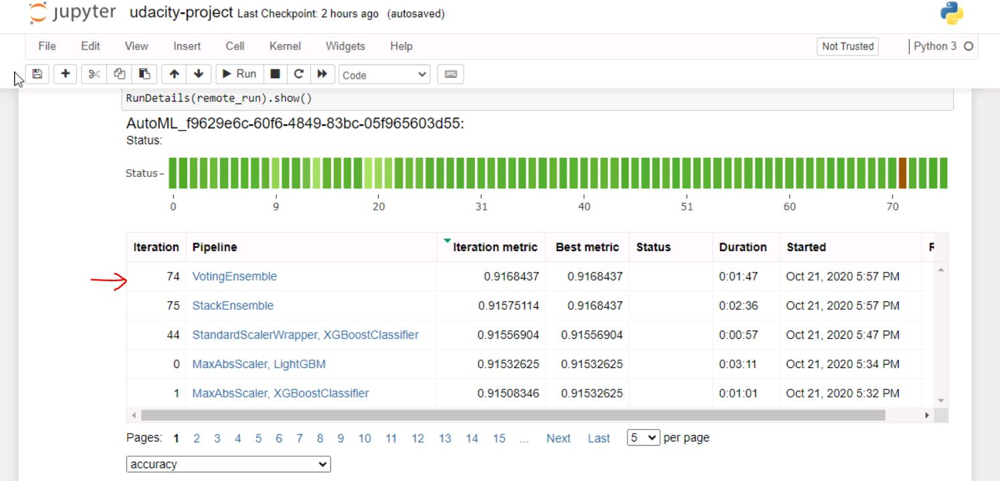

# Optimizing an ML Pipeline in Azure

## Overview
In this project, we build and optimize an Azure ML pipeline using the Python SDK and a Logistic Regression Scikit-learn model. Hyperparameter of the model will be tunned using Hyperdrive configuration. Later AutoML model is build and optimized on the same dataset. Comparison is then made between hyperdrive and automl model to select the best model as final solution approach.

## Summary

Dataset used in this project is Bankmarketing which consists of customer information such as age, job, marital status, number of years employed etc.  The y column indicates if a customer subscribed to a fixed term deposit, which is later identified as the target column for predictions. Problem is to build predictive classification model which tells us whether customer will subscribe to fixed deposit (yes/no) based on the customer information. 

Solution approach will be to build and train Logistic regression predictive model using two approaches Hyperdrive and Automl. Best performing model from both approaches will be chosen as final solution model.   

## Scikit-learn Pipeline
**Explain the pipeline architecture, including data, hyperparameter tuning, and classification algorithm.**

Hyperdrive pipleline is created using python sdk library. First reference to workspace and experiment is obtained. Compute cluster is created with VM_Size="STANDARD_D2_V2" and max number of nodes=4 and min number of nodes=1. 
Its CPU cluster where training will be executed using parameters specified in hyperdrive drive configuration. 

Dataset of bank marketing data is imported from Tabular Dataset factory specific the file_path. An SKLearn estimator is created with arguments to specify the compute cluster, script file consisting of training code and soure directory where script file can be located. 

```
est = SKLearn(source_directory='./training', 
                    compute_target=cpu_cluster_compute_target,
                    entry_script='train.py')
```

Hyperdrive configuration settings is created using the estimator, hyperparameter sampler, metric and policy.

```
hyperdrive_config = HyperDriveConfig(estimator=est,
                                     hyperparameter_sampling=ps, 
                                     primary_metric_name='Accuracy',
                                     primary_metric_goal=PrimaryMetricGoal.MAXIMIZE,
                                     max_total_runs=20,
                                     max_concurrent_runs=4)
```

Accuracy metric is chosen as evaluation metric for this problem statement. Task is to predict yes/no response and dataset is fairly balanced that justifies Accuracy as good metric to score the number of correct predictions off total predictions. Goal of hyperdrive experiment will be to maximize the accuracy metric. 

Limit is set on max concurrent run to 4 as we have maximum 4 CPU instance nodes avaliable for training. We kept max total runs not to exceed 20 to complete the experiment within time constraints. 

RandomParameterSampling is used for sampling parameters for this experiment. It defines random sampling over a hyperparameter search space. In this sampling algorithm, parameter values are chosen from a set of discrete values or a distribution over a continuous range.

```
ps = RandomParameterSampling( {
    "--max_iter": choice(10,20,30),
    "--C": choice(0.5, 1, 1.5)
    })
```

For the chosen Logistic Regression algorithm we set the range of discrete values for 'max_iter' and 'C' parameter as shown below: 

  - max_iter: Represents max runs for the experiment for specified iterations. Range of (10,20,30) is chosen to restrict the duration for which experiment runs. 
  - C: Represnets the regularization parameter. The strength of the regularization is inversely proportional to C. Must be strictly positive. The penalty is a squared l2 penalty.   

BanditPolicy is chosen as early stopping Policy for hperdrive experiment run. 
It defines an early termination policy based on slack criteria, and a frequency and delay interval for evaluation.
```
policy = BanditPolicy(slack_factor = 0.1, evaluation_interval=1, delay_evaluation=5)
```
The Bandit policy takes the following configuration parameters:

- slack_factor: The amount of slack allowed with respect to the best performing training run. This factor specifies the slack as a ratio.

- evaluation_interval: The frequency for applying the policy. Each time the training script logs the primary metric counts as one interval.

- delay_evaluation: The number of intervals to delay policy evaluation. Use this parameter to avoid premature termination of training runs. If specified, the policy applies every multiple of evaluation_interval that is greater than or equal to delay_evaluation.

## AutoML
AutoML settings represents the configuration for submitting an automated ML experiment in Azure Machine Learning. This configuration object contains and persists the parameters for configuring the experiment run, as well as the training data to be used at run time. 

```
automl_settings = {
    "experiment_timeout_minutes" : 25,
    "max_concurrent_iterations": 4,
    "n_cross_validations": 5,
    "primary_metric": 'accuracy',
}

automl_config = AutoMLConfig(task = 'classification',
                             debug_log = 'automl_errors.log',
                             compute_target=cpu_cluster_compute_target,
                             training_data = train_data,
                             label_column_name = label,
                             **automl_settings
                            )
```

Configuration used for this experiments are discussed below:

- experiment_timeout_minutes: Its an exit criteria in settings to define how long, in minutes, experiment should continue to run. To help avoid experiment time out failures, there is a minimum of 15 minutes, or 60 minutes if your row by column size exceeds 10 million. I have set it to 25mins for this automl run.

- max_concurrent_iterations:  Represents the maximum number of iterations that would be executed in parallel. The default value is 1. In this configuration I have set it to 4 as it should be less than or equal to the maximum number of nodes. Otherwise, runs will be queued until nodes are available.

- primary_metric: The metric that Automated Machine Learning will optimize for model selection. In this setting we have used Accuracy as primary metric. Also its a default metric for classification task. 

- n_cross_validations: Specifies how many cross validations to perform when user validation data is not specified. In this setting we have used 5 to represent 5-fold cross validation. It further validates the robustness of model. 

- task: The type of task to run. Values can be 'classification', 'regression', or 'forecasting' depending on the type of automated ML problem to solve. In this setting we have set it to 'classification' task. 

- training_data: The training data to be used within the experiment. It should contain both training features and a label column (optionally a sample weights column). If training_data is specified, then the label_column_name parameter must also be specified.

- label_column_name: The name of the label column. If the input data is from a pandas. DataFrame which doesn't have column names, column indices can be used instead, expressed as integers.

- debug_log: The log file to write debug information to. If not specified, 'automl.log' is used.


## Pipeline comparison

From both the experiments AutoML and Hyperdive we can observe the accuracy score of AutoML is significantly much better compared to accuracy score of Hyperdrive. Given that we decide to choose best Auto ML model as final solution approach. 

    Auto ML Accuracy score - 0.9168
    Hyperdrive Accuracy score - 0.9144

Auto ML experiment ran for 75 different model algorithm as we can see from the output of experiment run. VotingEnsemble clearly stood out with the best accuracy score of 0.9168
    

Hyperdrive experiment gave best score of 0.9144 with following best parameter estimates: 

 Best Params: ['--C', '1', '--max_iter', '30']

## Future work

Listed below are some of the suggested improvements: 
- Experiment can be ran for longer duration by increasing the time limit on automl parameter "experiment_timeout_minutes" : 180. Likewise for hyperdrive parameter we can increase the value for max_total_runs=100. Increasing the duration of experiment would yield better model score. 
- Range of hyperdrive parameter can be increased as allowing wider selection of parameter can lead to better score as shown below: 
    "--max_iter": choice(10,20,30,40,50,60,70,80,90,100),
    "--C": choice(0.1,0.5, 1, 1.5, 2.5) 
- There is scope to increase the size of training data. Adding more data can build more preditable and efficient model. 
- Include Deep Learning algorithm in AutoML configuration to allow wider selection of algorithm to evaluate Accuracy score. 
- Compute time of experiment can be improved by adding more CPU cluster to compute cluster instance or configurating GPU cluster.  

## Proof of cluster clean up
Compute cluster is clean up by calling the delete method on compute cluster object instance as shown below: 

```
cpu_cluster_compute_target.delete() #Remove the Compute object from its associated workspace.
```

Another option is to select the Compute Cluster rows from Azure ML workspace Compute Cluster tab and click on Delete button to delete the cluster nodes.  
